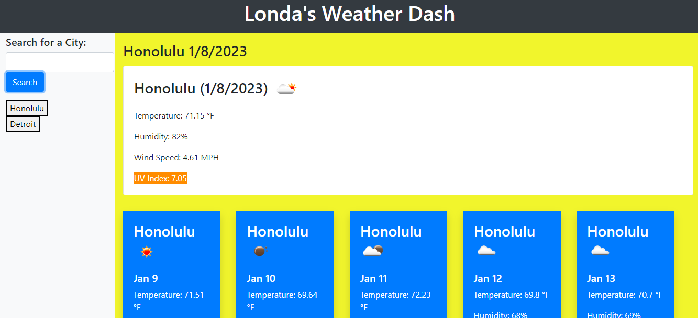

# Londa-Weather-Dash

## Actions Needed
Create a weather dashboard that displays the current weather based on the city input. A 5 day forecast will also be diplayed based on the city selected. 
## Actions Taken
Created custom API Key
Added Search button to html to be able to input text for city
Added function to get storage for recent searches
Added functions to gather weather data
Incorporated weather API site for functionality 

## Site Link
https://londanh.github.io/Londa-Weather-Dash/

## Screenshot

